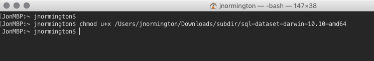
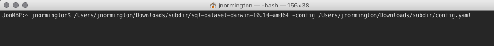
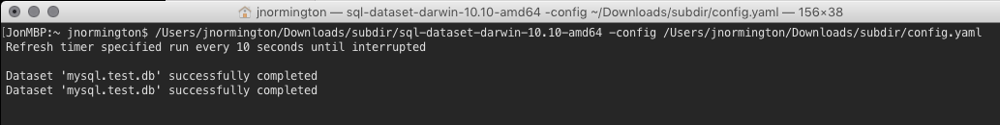

## Linux

### 1. Download

Click on the following link to download the binary for your architecture.

- [Linux x86](https://github.com/geckoboard/sql-dataset/releases/download/v0.1.0/sql-dataset-linux-386)
- [Linux x64](https://github.com/geckoboard/sql-dataset/releases/download/v0.1.0/sql-dataset-linux-amd64)

### 2. Build configuration file

As a starting point download the following [example config](docs/example.yml) - from here remove attributes you won't need and update the others. Below are some references for the different dataset fields and database configurations.

- [Database attributes](docs/database_fields.md)
- [Dataset & Field attributes](docs/dataset_fields.md)

Save the config file in the same place that you will find.

### 3. Run the program

Open an terminal and give the sql-dataset executable rights with `chmod u+x file_path`

Using your config pass the `-config` switch to the sql-dataset command so its looks similiar
to `./sql-dataset-linux-* -config your/config/file.yml` change the sql-dataset-linux to your downloaded file path.

Run the command if all is successful you will see an output similar to the below image

If you have the `refresh_time_sec` key in the config it will re-run the same query after that time. If you only want a one time send of the data or have it scheduled, just remove the key.

### 4. Build the widget from the Dataset

Head over to Geckoboard, and

 - Click 'Add Widget', and select the Datasets integration.
 - In the pop-out panel that appears you should see your new dataset.
 - You can use this to build a widget showing your data.
 - This will auto update every x seconds based on the config key value `refresh_time_sec`