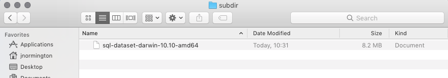
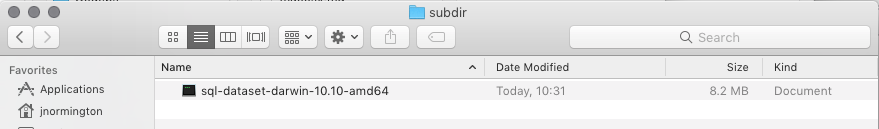

## macOS

### 1. Download

Click on the following link to download the app for macOS

[macOS](https://github.com/geckoboard/sql-dataset/releases/download/v0.1.0/sql-dataset-darwin-10.10-amd64)

### 2. Make the app executable

Before we can run the app we need to make it executable, which means a little bit of Terminal wizardry.

Locate where you downloaded SQL-Dataset in the Finder:

Open Terminal from your Applications folder, or via Spotlight.

In the Terminal window type `chmod u+x ` then drag the SQL-Dataset file from Finder into the terminal. It should populate the full path of the file.

Now press the Return key (Enter). In the Finder window you should see the icon change from white to black.

Voila, the app is ready to run. Head back to the main guide to learn how to use it.
