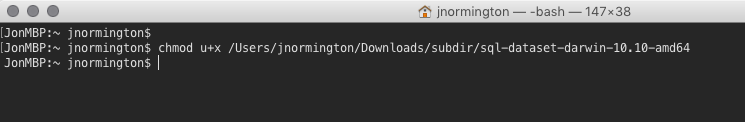
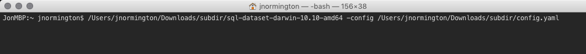

## OSX

### 1. Download

Click on the following link to download the executable for OSX

[Mac OSX](https://github.com/geckoboard/sql-dataset/releases/download/v0.1.0/sql-dataset-darwin-10.10-amd64)

### 2. Build configuration file

As a starting point download the following [example config](docs/example.yml) - from here remove attributes you won't need and update the others. Below are some references for the different dataset fields and database configurations.

- [Database attributes](docs/database_fields.md)
- [Dataset & Field attributes](docs/dataset_fields.md)

Try to save the config file in the same place as the downloaded binary, it will make the next step easier.

### 3. Run the program

To run the program we need to give it the executable flag. Open finder with the location of the sql-dataset download.

Using spotlight search for `terminal` and open that ready for use.

In the terminal window type `chmod u+x ` then drag the sql-dataset file from finder into the terminal. It should populate the full path of the file.

Now press the Return key (Enter) looking back the finder window you should see the icon change from white to black

Now we are ready to run the program with your configuration file you built earlier. Press return key a couple of times, 

Drag the sql-dataset file into the terminal window again.

Then type ` -config` after the amd64 observe a space before and after ` -config `, now drag the config into the terminal window as well.

It should look similar to the below image

Now click on the terminal window, and press the Return key (Enter) on your keyboard, if all is successful. It will begin to run.

If you have the `refresh_time_sec` key in the config it will re-run the same query after that time. If you only want a one time send of the data or have it scheduled, just remove the key.

### 4. Build the widget from the Dataset

Head over to Geckoboard, and

 - Click 'Add Widget', and select the Datasets integration.
 - In the pop-out panel that appears you should see your new dataset.
 - You can use this to build a widget showing your data.
 - This will auto update every x seconds based on the config key value `refresh_time_sec`