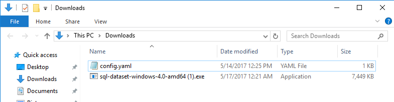
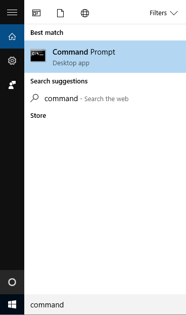
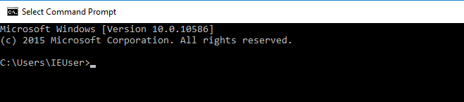
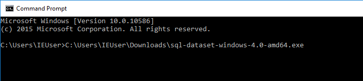
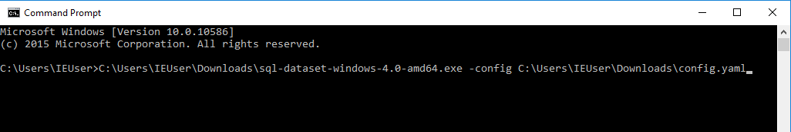
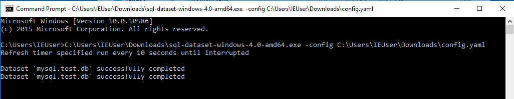

## Windows

### 1. Download

Click on the following link to download the executable if you are unsure to download x86 or x64, then just download the x86 version.

- [Windows x86](https://github.com/geckoboard/sql-dataset/releases/download/v0.1.0/sql-dataset-windows-8.0-386.exe)
- [Windows x64](https://github.com/geckoboard/sql-dataset/releases/download/v0.1.0/sql-dataset-windows-8.0-amd64.exe)

You maybe be presented with the following warning from your browser

This is due to the fact that the binary isn't signed, but is fine. Click View downloads, this should open up your download folder. **Keep this open for later.**

### 2. Build configuration file

As a starting point download the following [example config](docs/example.yml) - from here remove attributes you won't need and update the others. Below are some references for the different dataset fields and database configurations.

- [Database attributes](docs/database_fields.md)
- [Dataset & Field attributes](docs/dataset_fields.md)

Try to save the config file in the same place as the downloaded executable, it will make the next step easier.

### 3. Run the program

Search for `command` within cortana it should return Command Prompt as a matching application.

Click on Command Prompt, which should open the following window

Using the downloads folder window, drag the sql-dataset file into the command prompt window. The command prompt window should update with the full path of the program.

Now in the command prompt window type ` -config ` observe the space before `-` and space after `config` to seperate it from the executable path.

Once you have done that drag the config file into the command prompt window like you did with the sqldataset program.

Your command prompt should look something similar to below

Now click on the command prompt window, and press the Return key (Enter) on your keyboard, if all is successful. It will begin to run.

If you have the `refresh_time_sec` key in the config it will re-run the same query after that time. If you only want a one time send of the data or have it scheduled, just remove the key.

### 4. Build the widget from the Dataset

Head over to Geckoboard, and

 - Click 'Add Widget', and select the Datasets integration.
 - In the pop-out panel that appears you should see your new dataset.
 - You can use this to build a widget showing your data.
 - This will auto update every x seconds based on the config key value `refresh_time_sec`